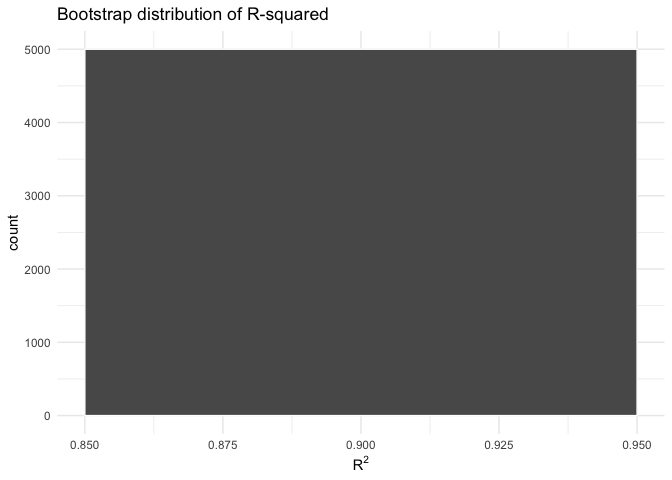
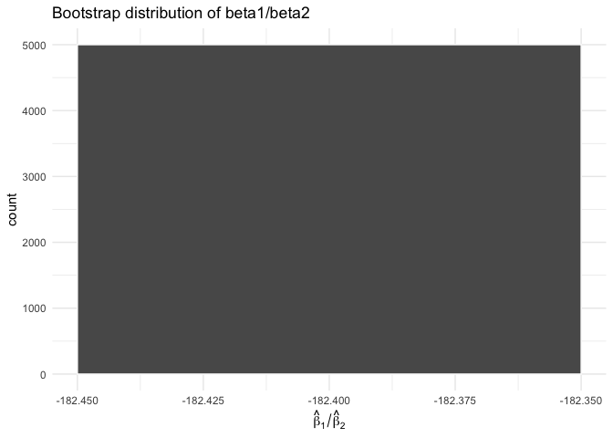

p8105_hw6
================
Yiying Chen yc4776
2025-12-02

``` r
library(tidyverse)
homicide_data = read.csv("data/homicide-data.csv")

homicide_data_clean = homicide_data |>
  mutate(city_state = paste(city, state, sep = ", "),
         resolved = case_when(
      disposition == "Open/No arrest"  ~ 0,
      disposition != "Open/No arrest" ~ 1),
      victim_age = as.numeric(victim_age)) |>
  filter(!city_state %in% c("Dallas, TX", "Phoenix, AZ", "Kansas City, MO", "Tulsa, AL"))|>
  filter(victim_race %in% c("White","Black"))
```

``` r
library(broom)

baltimore_data = 
  homicide_data_clean |>
  filter(city_state == "Baltimore, MD")

set.seed(123)
baltimore_fit = 
  baltimore_data |> 
  glm(resolved ~ victim_age + victim_race + victim_sex, data = _, family = binomial()) 

baltimore_fit |> 
  broom::tidy(exponentiate = TRUE, conf.int = TRUE) |> 
  filter(term == "victim_sexMale") |> 
  select(term, OR = estimate, conf.low, conf.high) |> 
  knitr::kable(digits = 3)
```

| term           |    OR | conf.low | conf.high |
|:---------------|------:|---------:|----------:|
| victim_sexMale | 0.355 |    0.267 |     0.468 |

``` r
city_data =
  homicide_data_clean |>
  group_by(city_state) |>
  tidyr::nest() |>
  mutate(
    city_fit = purrr::map(
      data,
      ~ glm(
          resolved ~ victim_age + victim_sex + victim_race,
          data   = .x,
          family = binomial()
        )
    ),
    city_tidy = purrr::map(
      city_fit,
      ~ broom::tidy(.x, exponentiate = TRUE, conf.int = TRUE)
    )
  ) |>
  tidyr::unnest(city_tidy) |>
  ungroup() |>
  
  filter(term == "victim_sexMale") |>
  select(city_state, estimate, conf.low, conf.high)

city_data
```

    ## # A tibble: 47 × 4
    ##    city_state      estimate conf.low conf.high
    ##    <chr>              <dbl>    <dbl>     <dbl>
    ##  1 Albuquerque, NM    0.430   0.132      1.16 
    ##  2 Atlanta, GA        0.512   0.323      0.789
    ##  3 Baltimore, MD      0.355   0.267      0.468
    ##  4 Baton Rouge, LA    0.319   0.160      0.596
    ##  5 Birmingham, AL     0.704   0.444      1.09 
    ##  6 Boston, MA         0.674   0.353      1.28 
    ##  7 Buffalo, NY        0.438   0.239      0.793
    ##  8 Charlotte, NC      0.301   0.143      0.572
    ##  9 Chicago, IL        0.391   0.321      0.476
    ## 10 Cincinnati, OH     0.206   0.0977     0.390
    ## # ℹ 37 more rows

``` r
city_data |>
  mutate(
    city_state = fct_reorder(city_state, estimate)
  ) |>
  ggplot(aes(x = estimate, y = city_state)) +
  geom_point() +
  geom_errorbarh(aes(xmin = conf.low, xmax = conf.high), height = 0) +
  labs(
    x = "estimated ORs",
    y = "City",
    title = "Estimated ORs and CIs for each city for solving homicides comparing male victims to female victims"
  ) +
  theme_minimal() +
  theme(
    axis.text.y = element_text(size = 6),
    plot.title = element_text(size = 8)
  )
```

<!-- -->

``` r
library(tidyverse)
library(p8105.datasets)
data("weather_df")

set.seed(123)
boot_sample = function(df) {
  sample_frac(df, replace = TRUE)
}

boot_straps = 
  tibble(strap_number = 1:5000) |>
  mutate(
    strap_sample = map(strap_number, \(i) boot_sample(df = weather_df))
  )

boot_results =
  boot_straps |> 
  mutate(
    boot_fit   = map(strap_sample,\(df) lm(tmax ~ tmin + prcp, data = df)),
    boot_glance = map(boot_fit, broom::glance),   
    boot_tidy   = map(boot_fit, broom::tidy)
  )

boot_results =
  boot_results |>
  mutate(
    r_squared = map_dbl(boot_glance, "r.squared"),
    beta_ratio = map_dbl(
      boot_tidy,
      \(df) {
        b1 <- filter(df, term == "tmin") |> pull(estimate)
        b2 <- filter(df, term == "prcp") |> pull(estimate)
        b1 / b2
      }
    )
  )|>
  select(strap_number, r_squared, beta_ratio)

ggplot(boot_results, aes(x = r_squared)) +
  geom_histogram(bins = 30, color = "white") +
  labs(
    x = expression(R^2),
    title = "Bootstrap distribution of R-squared"
  ) +
  theme_minimal()
```

<!-- -->

``` r
ggplot(boot_results, aes(x = beta_ratio)) +
  geom_histogram(bins = 30, color = "white") +
  labs(
    x = expression(hat(beta)[1] / hat(beta)[2]),
    title = "Bootstrap distribution of beta1/beta2"
  ) +
  theme_minimal()
```

<!-- -->

``` r
boot_results |> 
  summarize(
    r2_lower = quantile(r_squared, 0.025),
    r2_upper = quantile(r_squared, 0.975),
    
    ratio_lower = quantile(beta_ratio, 0.025),
    ratio_upper = quantile(beta_ratio, 0.975)
  )
```

    ## # A tibble: 1 × 4
    ##   r2_lower r2_upper ratio_lower ratio_upper
    ##      <dbl>    <dbl>       <dbl>       <dbl>
    ## 1    0.934    0.947       -279.       -125.

\#In the Bootstrap distribution of R-squared, it’s a nearly symmetric
distribution, centered around about 0.94. \#In the Bootstrap
distribution of beta1/beta2, it’s a right-skewed distribution.

``` r
birthweight = 
  read.csv("data/birthweight.csv") |>
  janitor::clean_names() |>
  mutate(
    babysex = as.factor(babysex),
    malform = as.factor(malform),
    mrace   = as.factor(mrace),
    frace   = as.factor(frace)
  )

summary(birthweight)
```

    ##  babysex      bhead          blength           bwt           delwt      
    ##  1:2230   Min.   :21.00   Min.   :20.00   Min.   : 595   Min.   : 86.0  
    ##  2:2112   1st Qu.:33.00   1st Qu.:48.00   1st Qu.:2807   1st Qu.:131.0  
    ##           Median :34.00   Median :50.00   Median :3132   Median :143.0  
    ##           Mean   :33.65   Mean   :49.75   Mean   :3114   Mean   :145.6  
    ##           3rd Qu.:35.00   3rd Qu.:51.00   3rd Qu.:3459   3rd Qu.:157.0  
    ##           Max.   :41.00   Max.   :63.00   Max.   :4791   Max.   :334.0  
    ##     fincome      frace       gaweeks      malform     menarche    
    ##  Min.   : 0.00   1:2123   Min.   :17.70   0:4327   Min.   : 0.00  
    ##  1st Qu.:25.00   2:1911   1st Qu.:38.30   1:  15   1st Qu.:12.00  
    ##  Median :35.00   3:  46   Median :39.90            Median :12.00  
    ##  Mean   :44.11   4: 248   Mean   :39.43            Mean   :12.51  
    ##  3rd Qu.:65.00   8:  14   3rd Qu.:41.10            3rd Qu.:13.00  
    ##  Max.   :96.00            Max.   :51.30            Max.   :19.00  
    ##     mheight          momage     mrace        parity            pnumlbw 
    ##  Min.   :48.00   Min.   :12.0   1:2147   Min.   :0.000000   Min.   :0  
    ##  1st Qu.:62.00   1st Qu.:18.0   2:1909   1st Qu.:0.000000   1st Qu.:0  
    ##  Median :63.00   Median :20.0   3:  43   Median :0.000000   Median :0  
    ##  Mean   :63.49   Mean   :20.3   4: 243   Mean   :0.002303   Mean   :0  
    ##  3rd Qu.:65.00   3rd Qu.:22.0            3rd Qu.:0.000000   3rd Qu.:0  
    ##  Max.   :77.00   Max.   :44.0            Max.   :6.000000   Max.   :0  
    ##     pnumsga      ppbmi            ppwt           smoken           wtgain      
    ##  Min.   :0   Min.   :13.07   Min.   : 70.0   Min.   : 0.000   Min.   :-46.00  
    ##  1st Qu.:0   1st Qu.:19.53   1st Qu.:110.0   1st Qu.: 0.000   1st Qu.: 15.00  
    ##  Median :0   Median :21.03   Median :120.0   Median : 0.000   Median : 22.00  
    ##  Mean   :0   Mean   :21.57   Mean   :123.5   Mean   : 4.145   Mean   : 22.08  
    ##  3rd Qu.:0   3rd Qu.:22.91   3rd Qu.:134.0   3rd Qu.: 5.000   3rd Qu.: 28.00  
    ##  Max.   :0   Max.   :46.10   Max.   :287.0   Max.   :60.000   Max.   : 89.00
